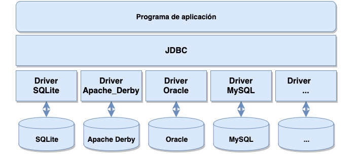
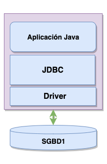
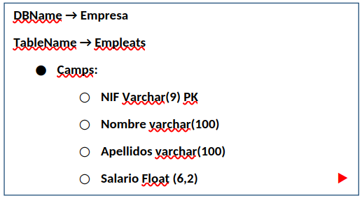

# Maneig de Connectors

**L'accés a dades** és el procés de recuperació o manipulació de dades obtingudes des d'un origen local o remot.

**Els orígens de dades** poden ser de diversa índole:
- Una base de dades relacional.
- Un full de càlcul.
- Un fitxer de text.
- Un servei web remot.
- Etc.

En aquesta unitat ens centrarem en els orígens de dades relacionals i aprendrem a realitzar **aplicacions Java per accedir a bases de dades** relacionals mitjançant l'ús de **connectors**.

---

## 1. Desfasament Objecte-Relacional

Encara que existeixen bases de dades orientades a objectes (**OODB**), el mercat està dominat per les **bases de dades relacionals**, ja que ofereixen un millor rendiment i més flexibilitat en diversos àmbits.

No obstant això, el paradigma de programació dominant avui dia és la **Programació Orientada a Objectes (POO)**:
- Les **bases de dades relacionals no estan dissenyades per emmagatzemar objectes**; les dades estan estructurades en **taules**, i són les **relacions** les que permeten vincular les diferents taules.
- Això crea un desfasament entre les estructures del model relacional i els models de dades utilitzats en POO. Per tant, és necessari un esforç addicion a l'hora de programar per conjuntar o fer conpatibles els dos paradigmes.
- A aquest concepte s'anomena **desfasament objecte-relacional** i es refereix a les dificultats tècniques que sorgeixen per les diferències entre aquests dos models.  Es a dir, totes les dificultats tècniques que trobem quan mesclem els dos paradigmes.

## 2. Connectors

Els sistemes gestors de bases de dades (**SGBD**) utilitzen llenguatges especialitzats per operar amb les dades que emmagatzemen. Mentrestant, les aplicacions s'escriuen en llenguatges de programació de propòsit general, com Java.

Per permetre que aquestes aplicacions es comuniquen amb els SGBD, es **necessiten mecanismes específics**. Aquests mecanismes es desenvolupen com a **APIs** i es denominen **connectors**.

---

{: .text-center}


---


#### Característiques dels connectors:
- Per treballar amb bases de dades relacionals (RDBMS), s'utilitza el llenguatge **SQL**.
- Cada RDBMS té la seva pròpia versió de SQL amb peculiaritats específiques, requerint així estructures de baix nivell personalitzades.

L'ús de **drivers** permet desenvolupar una arquitectura genèrica. Els connectors defineixen una interfície comuna entre les aplicacions i les bases de dades, mentre que els drivers s'encarreguen de gestionar les particularitats de cada base de dades.

---

{: .text-center}


---


Així, el connector no és només una API, sinó una **arquitectura** que especifica **les interfícies que han d'implementar els diferents drivers** per accedir a les bases de dades.

---

#### Arquitectures de connectors:
- **ODBC (Open Database Connectivity)**: Defineix una API per obrir connexions amb bases de dades, enviar consultes, actualitzacions, etc. Es pot utilitzar amb qualsevol servidor de bases de dades compatible. Està escrit en llenguatge C.
- **JDBC (Java Database Connectivity)**: És l'API per excel·lència per connectar bases de dades amb aplicacions Java. Ens centrarem en aquesta API en aquesta unitat.
- **OLE-DB**: Orientat a aplicacions Windows.
- **ADO**: Variant d'OLE-DB.

Avui dia, les arquitectures més utilitzades són **ODBC** i **JDBC**, ja que són compatibles amb la majoria dels SGBD. Tot i això, ofereixen beneficis a canvi d'una major complexitat de programació.

---

## 3. JDBC – Accés a Bases de Dades Relacionals

JDBC és una API que permet accedir a fonts de dades relacionals SQL des d'aplicacions Java. Aquesta arquitectura ofereix una interfície comú perquè els fabricants de SGBD puguin crear drivers que connecten les aplicacions Java amb les bases de dades.

### Característiques de JDBC:
- JDBC proporciona una **interfície específica per a cada SGBD**, coneguda com a **driver**.
- Les **crides als mètodes Java** es corresponen amb **operacions SQL**, facilitant la interacció entre l'aplicació i la base de dades.

---

{: .text-center}


---


### Tasques principals amb JDBC:
JDBC inclou un conjunt d'interfícies i classes que permeten desenvolupar aplicacions en Java per:

1. **Connectar-se** a una base de dades.
2. **Enviar consultes** i instruccions d'actualització.
3. **Recuperar i processar resultats** d'una base de dades en resposta a aquestes consultes.

### Models d'accés amb JDBC:

L’API JDBC és compatible amb dos models d'accés: **model de dues capes** i **model de tres capes**.

- **Model de dues capes**:
  - L'aplicació Java interactua directament amb la base de dades mitjançant un driver JDBC.
  - Les sentències SQL s'envien des del programa Java al SGBD, i aquest retorna els resultats.
  - Pot operar localment o a través de la xarxa.

---

{: .text-center}


---


- **Model de tres capes**:
  - Les peticions passen per una capa intermèdia que gestiona la comunicació amb la base de dades.


---

{: .text-center}


---


### Tipus de drivers JDBC:
- **JDBC-ODBC Bridge**: Permet accedir a bases de dades JDBC mitjançant ODBC.
- **Native**: Drivers escrits parcialment en Java i codi natiu específic del SGBD.
- **Network**: Drivers 100% Java que utilitzen protocols de xarxa per comunicar-se amb el servidor de bases de dades.
- **Thin**: Drivers 100% Java amb protocol natiu, que tradueixen crides JDBC a crides del protocol del SGBD.


### Funcionament de JDBC
JDBC defineix un conjunt de classes i interfícies al paquet `java.sql`. Les més importants són:


| Classe/Interfície      | Descripció                                                                                  |
|-------------------------|--------------------------------------------------------------------------------------------|
| **Driver**             | Permet connectar-se a una base de dades. Cada SGBD necessita un driver específic.          |
| **DriverManager**      | Gestiona els drivers instal·lats en el sistema.                                            |
| **DriverPropertyInfo** | Proporciona informació sobre el driver.                                                    |
| **Connection**         | Representa una connexió amb una base de dades. És possible tenir més d'una connexió alhora. |
| **DatabaseMetadata**   | Proporciona informació sobre la base de dades.                                             |
| **Statement**          | Executa sentències SQL sense paràmetres.                                                   |
| **PreparedStatement**  | Executa sentències SQL amb paràmetres d'entrada.                                           |
| **CallableStatement**  | Executa sentències SQL amb paràmetres d'entrada i d'eixida, com crides a procediments emmagatzemats. |
| **ResultSet**          | Conté les files resultants d'una consulta SELECT.                                          |
| **ResultSetMetadata**  | Proporciona informació sobre un ResultSet, com el nombre de columnes i els seus noms.      |

---

### Passos per a utilitzar JDBC en una aplicació Java
Per connectar una aplicació Java a una base de dades amb JDBC, seguirem els següents passos:

1. Importar les classes necessàries:
2. Carregar el driver JDBC.
3. Identificalr l'origen de dades (la BDA).
4. Crear un objecte **`Connection`**.
5. Crear un objecte **`Statement`**.
6. Executar una consulta SQL amb l'objecte **`Statement`**.
7. Recuperar el reultat de la consulta amb l'objecte **`ResultSet`**.
8. Alliberar recursos. (Per ordre invers al que s'han creat, **ResultSet, Statement, Connection**).

{: .text-center }


Resumint, per connectar una base de dates a una aplicació java amb JDBC seguirem 4 passos:

```
1. Carregar el driver.
2. Establir la connexió.
3. Executar sentencies SQL.
4. Alliberar recursos.
``` 


### Apunts Millorats

#### Resum: Passos per Connectar una Base de Dades a una Aplicació Java amb JDBC

Per connectar una base de dades a una aplicació Java amb JDBC seguirem aquests quatre passos fonamentals:

1. **Carregar el driver.**
2. **Establir la connexió.**
3. **Executar sentències SQL.**
4. **Alliberar recursos.**

---

####Exemple de Connexió i Consulta a Bases de Dades

A continuació es mostra un exemple pràctic de com realitzar una connexió a una base de dades MySQL, executar una consulta i processar els resultats.

{: .text-center}


---

### 1. Carregar els Drivers

El primer pas és carregar el driver utilitzant el mètode **`forName`** de la classe **`Class`**. Es passa com a argument un **String** amb el nom de la classe del driver.

**Exemple:**
```java
Class.forName("com.mysql.cj.jdbc.Driver");
```

Aquest mètode assegura que el driver es carregue a memòria, permetent establir connexions a la base de dades.

---

### 2. Establir la Connexió

A continuació, establim una connexió a la base de dades usant el mètode **`getConnection()`** de la classe **`DriverManager`**. Aquest mètode requereix tres paràmetres:

- **URL**: Localització de la base de dades.
- **USER**: Nom d'usuari.
- **PASS**: Contrasenya.

**Exemple:**
```java
Connection conn = DriverManager.getConnection(
    "jdbc:mysql://localhost:3306/nom.db", "usuari", "contrasenya");
```

---

### 3. Executar Sentències SQL

Per realitzar una consulta SQL, fem servir la **interfície `Statement`**. Els passos són:

1. Crear un objecte `Statement` a partir de la connexió vàlida. 
   - Per a obtindre un objecte `Statement` cridem al mètode `createStatement()` d'un objecte `Connection vàlid.
2. Utilitzar el mètode `executeQuery()` per executar una consulta SQL.
3. Recollir el resultat de la consulta en un objecte `ResultSet`.

**Exemple:**
```java
Statement stmt = conn.createStatement();
String sql = "SELECT * FROM taula";
ResultSet rs = stmt.executeQuery(sql);

while (rs.next()) {
    System.out.println(rs.getString("nom_columna"));
}
```
o directament

```java
...
ResultSet rs = stmt.executeQuery("SELECT * FROM taula");
...
```

#### Notes sobre `ResultSet`:
- `ResultSet` conté totes les dades retornades pel SGBD en resposta a la consulta.
- Té un punter inicial que apunta al primer element de la primera fila.
- El mètode `next()`:
  - Avança el punter a la següent fila.
  - Retorna `true` si existeix una altra fila, o `false` si s'ha arribat al final.
  - Utilizant els mètodes **`getString()`** i **`getDouble()`** anem obtenint els valors de les diferents columnes. Aquests mètodes reben el nom de la columna com a paràmetre.
  - 

#### Exemple d'ús de `ResultSet`:
```java
while (rs.next()) {
    String valor1 = rs.getString("columna1");
    double valor2 = rs.getDouble("columna2");
    System.out.println("Valor 1: " + valor1 + ", Valor 2: " + valor2);
}
```

---

### 4. Alliberar Recursos

És important alliberar els recursos utilitzats per evitar fuites de memòria o bloquejos de connexió. Això inclou tancar el `ResultSet`, el `Statement` i la `Connection`.

**Exemple:**
```java
rs.close();
stmt.close();
conn.close();
```

---

### IMPORTANT
1. **Imports necessaris:**
   Tots els imports per manejar bases de dades estan inclosos en el paquet `java.sql`.

   ```java
   import java.sql.*;
   ```

2. **Gestió d'Excepcions:**
   La majoria dels mètodes relatius a bases de dades poden llançar l'excepció `SQLException`. Per tant, és essencial utilitzar blocs `try/catch` per capturar i gestionar aquestes excepcions.

   **Exemple1:**
   ```java
   try {
       Connection conn = DriverManager.getConnection("jdbc:mysql://localhost:3306/nombredb", "usuari", "contrasenya");
       Statement stmt = conn.createStatement();
       ResultSet rs = stmt.executeQuery("SELECT * FROM taula");

       while (rs.next()) {
           System.out.println(rs.getString("columna1"));
       }

       rs.close();
       stmt.close();
       conn.close();
   } catch (SQLException e) {
       e.printStackTrace();
   }
   ```

**Exemple2:**

---
{: .text-center}


---

## 4. Execució de Sentències DML

En SQL, les sentències **DML (Data Manipulation Language)** són aquelles que ens permeten treballar amb les dades d'una base de dades. Els tipus principals són:

- **SELECT**: Per obtenir dades d'una base de dades.
- **INSERT**: Per inserir dades a una taula.
- **UPDATE**: Modifica dades existents dins d'una taula.
- **DELETE**: Elimina registres d'una taula (els espais assignats als registres no esborren).

Per executar aquestes sentències SQL en Java, hem d'utilitzar objectes de tipus:

1. **`Statement`**: Permet executar sentències SQL sense paràmetres.
2. **`PreparedStatement`**: Permet executar sentències SQL amb paràmetres.

---

## La Interfície Statement

La interfície **Statement** permet crear objectes `Statement` per executar sentències SQL. Com és una interfície, no es pot instanciar directament. En canvi, s'ha d'obtenir mitjançant el mètode `createStatement()` de la classe `Connection` (com s'ha vist en exemples anteriors).

### Mètodes de `Statement`

| Mètode                                | Descripció                                                                                   |
|---------------------------------------|---------------------------------------------------------------------------------------------|
| **`ResultSet executeQuery(String query)`** | Executa sentències SQL que recuperen dades. Retorna un objecte `ResultSet` amb les dades recuperades. |
| **`int executeUpdate(String query)`** | Executa sentències com `INSERT`, `UPDATE` o `DELETE`. Retorna un enter amb el nombre de registres afectats. |
| **`boolean execute(String query)`**   | Executa qualsevol consulta SQL. Si retorna un `ResultSet`, el mètode retorna `true`; en cas contrari, `false`. |

En cas que el mètode `execute()` retorne `false`, podem utilitzar:
- **`getUpdateCount()`**: Per obtenir el nombre de registres afectats.

---

## La Interfície PreparedStatement

És molt habitual l'ús de variables dins d'una sentència SQL:
- Valors a inserir, actualitzar o esborrar
- Filtres en consultes de selecció.
- Qualsevol consulta amb parts variables.
- Etc.

Per a estge tipus deconsultes que tenen parts variables, hem de fer ús de les anomenades **Sentències Preparades** (**prepared Statements**)

El **`PreparedStatement`** és una versió més avançada i flexible de `Statement`. Es fa servir principalment quan les consultes SQL inclouen **paràmetres variables**.


Els **placeholders** (o marcadors de posició) dins de les consultes SQL es representen amb signes d'interrogació (`?`). Cada placeholder té un índex que comença des de **1** i s'ha d'assignar un valor abans d'executar la consulta.

### Avantatges de `PreparedStatement`:
- Les consultes es **precompilen** una vegada i es poden executar múltiples vegades amb valors d'entrada diferents, millorant el rendiment.
- Major seguretat, ja que ajuda a prevenir atacs **SQL Injection**.

---

### Mètodes de `PreparedStatement`

| Mètode                   | Descripció                                                                                  |
|--------------------------|----------------------------------------------------------------------------------------------|
| **`ResultSet executeQuery()`** | Similar al mètode `executeQuery` de la interfície `Statement`.                          |
| **`int executeUpdate()`** | Similar al mètode `executeUpdate` de la interfície `Statement`.                              |
| **`boolean execute()`**  | Similar al mètode `execute` de la interfície `Statement`.                                     |

##### Assignació de Valors als Placeholders

| Mètode                         | Tipus SQL    |
|--------------------------------|--------------|
| `void setString(int index, String valor)` | `VARCHAR`   |
| `void setBoolean(int index, boolean valor)` | `BIT`        |
| `void setInt(int index, int valor)`       | `INTEGER`    |
| `void setDouble(int index, double valor)` | `DOUBLE`     |
| `void setDate(int index, Date valor)`     | `DATE`       |

Per assignar un **valor NULL**:
```java
pstmt.setNull(1, java.sql.Types.VARCHAR);
```

---

### Exemple amb `PreparedStatement`

```java
PreparedStatement pstmt = conn.prepareStatement(
    "SELECT LastName, FirstName FROM Person.Contact WHERE LastName = ?");
pstmt.setString(1, "Smith");
ResultSet rs = pstmt.executeQuery();

while (rs.next()) {
    System.out.println("Cognom: " + rs.getString("LastName"));
    System.out.println("Nom: " + rs.getString("FirstName"));
}
```

---

#### La Classe ResultSet

El **`ResultSet`** és una estructura que conté els resultats d'una consulta SQL. Permet accedir a cada fila retornada i obtenir-ne els valors mitjançant el nom o l'índex de les columnes.

##### Mètodes de `ResultSet`

| Mètode                           | Tipus Java       |
|----------------------------------|------------------|
| `getString(int columna)`         | `String`         |
| `getInt(int columna)`            | `int`            |
| `getDouble(int columna)`         | `double`         |
| `getDate(int columna)`           | `Date`           |

---

### Recorregut d'un `ResultSet`

El `ResultSet` utilitza un punter que inicialment es troba abans de la primera fila. Per recórrer-lo:
1. El mètode `next()` mou el punter a la següent fila i retorna `true` si existeix.
2. Utilitzem els mètodes `getX()` per accedir als valors de les columnes.

**Exemple:**
```java
while (rs.next()) {
    System.out.println("Cognom: " + rs.getString("LastName"));
    System.out.println("Nom: " + rs.getString("FirstName"));
}
```

---


### Apunts Millorats amb les Millores Aplicades

#### 5. Execució de Sentències DDL

Encara que la majoria d'operacions que es realitzen des d'una aplicació client contra una base de dades són de **manipulació de dades (DML)**, hi ha situacions en què cal dur a terme operacions de **definició de dades (DDL)**. Aquestes operacions permeten modificar l'estructura de la base de dades.

##### Casos comuns:
- Quan instal·lem una aplicació en un nou equip i cal crear una base de dades local de manera automatitzada per al seu funcionament.
- Quan una actualització de programari requereix canvis en l'estructura de la base de dades.
- Quan desconeixem l'estructura d'una base de dades i necessitem realitzar consultes dinàmiques.

Aquest apartat estudia els mecanismes per abordar aquestes situacions.

---

#### Definició i Modificació d’Estructures

Les sentències **DDL (Data Definition Language)** són instruccions SQL que defineixen o modifiquen l'estructura d'una base de dades. Les podem executar amb les interfícies `Statement` o `PreparedStatement`, com hem vist amb DML.

##### Exemple d'instrucció SQL DDL:
```sql
CREATE TABLE IF NOT EXISTS usuaris (
    id INT AUTO_INCREMENT PRIMARY KEY,
    nom VARCHAR(100) NOT NULL,
    correu VARCHAR(100) UNIQUE NOT NULL
);
```

---

##### **Ús del modificador `IF NOT EXISTS`**
Aquest modificador assegura que l'operació només es realitzarà si l'element (taula, vista, etc.) no existeix.

**Aplicacions habituals:**
- Crear bases de dades i les seves estructures (taules, restriccions, vistes, índexs...).
- En aplicacions locals o mòbils, on és freqüent que cada instal·lació requereixi una base de dades independent.

---

##### **Exemple en Java: Crear una Taula**
Amb `Statement`, podem crear una taula de manera programàtica:

```java
Statement stmt = conn.createStatement();
String sql = "CREATE TABLE IF NOT EXISTS usuaris (" +
             "id INT AUTO_INCREMENT PRIMARY KEY, " +
             "nom VARCHAR(100) NOT NULL, " +
             "correu VARCHAR(100) UNIQUE NOT NULL)";
stmt.executeUpdate(sql);
```

- **Millora aplicada**: **Exemple pràctic codificat**:
  He inclòs un exemple complet que mostra com crear una taula utilitzant `Statement`.

---

#### Consultes Dinàmiques sobre l’Estructura de la BBDD

Quan desconeixem l'estructura d'una base de dades, podem obtenir informació mitjançant els **metaobjectes** que aquesta emmagatzema. La interfície `DatabaseMetaData` ens proporciona una gran quantitat d'informació sobre l'estructura de la base de dades.

##### Mètodes principals de `DatabaseMetaData`

| Mètode                       | Descripció                                                                 |
|------------------------------|---------------------------------------------------------------------------|
| `ResultSet getTables()`      | Proporciona informació sobre diferents tipus d'objectes de la base de dades (taules, vistes, etc.). |
| `ResultSet getColumns()`     | Retorna informació sobre les columnes d'una taula.                       |
| `ResultSet getPrimaryKeys()` | Retorna informació sobre les claus primàries d'una taula.                 |
| `ResultSet getExportedKeys()`| Retorna informació sobre les claus alienes que apunten a una taula.       |
| `ResultSet getImportedKeys()`| Retorna informació sobre les claus alienes d'una taula.                  |

---

##### **Exemple d’ús: Obtenir informació de les taules**

Podem utilitzar el mètode `getTables()` per obtenir una llista de les taules existents:

```java
DatabaseMetaData metaData = conn.getMetaData();
ResultSet rs = metaData.getTables(null, null, "%", new String[]{"TABLE"});

while (rs.next()) {
    System.out.println("Taula: " + rs.getString("TABLE_NAME"));
}
```

---

##### Paràmetres del mètode `getTables`

| Paràmetre   | Descripció                                                                                  |
|-------------|---------------------------------------------------------------------------------------------|
| **catàleg** | Catàleg de la base de dades a consultar. Si és `null`, utilitza el catàleg actual.          |
| **esquema** | Esquema de la base de dades. Si és `null`, utilitza l'esquema actual.                      |
| **patró**   | Patró per filtrar noms d'objectes, similar a l'ús de `LIKE`.                               |
| **tipus**   | Tipus d'objectes a buscar (`TABLE`, `VIEW`, etc.).                                         |

---

#### Exemples de Resultats amb `DatabaseMetaData`

**Consulta de columnes d'una taula:**

```java
ResultSet rs = metaData.getColumns(null, null, "usuaris", null);

while (rs.next()) {
    System.out.println("Columna: " + rs.getString("COLUMN_NAME") +
                       ", Tipus: " + rs.getString("TYPE_NAME"));
}
```

---
